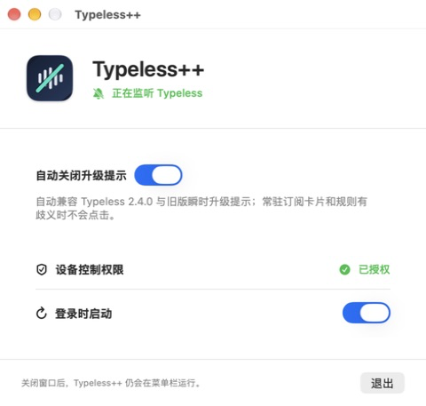
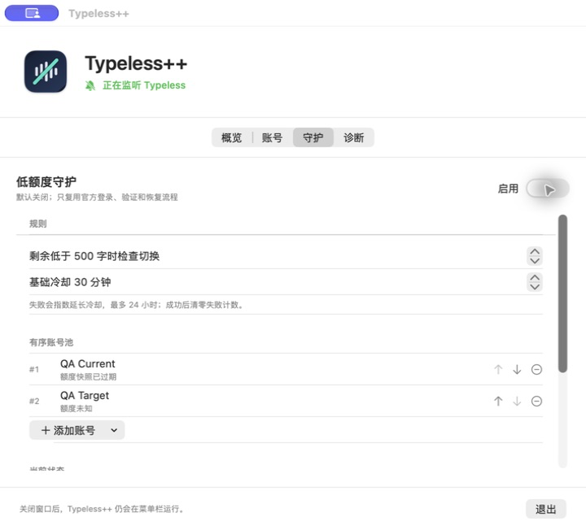
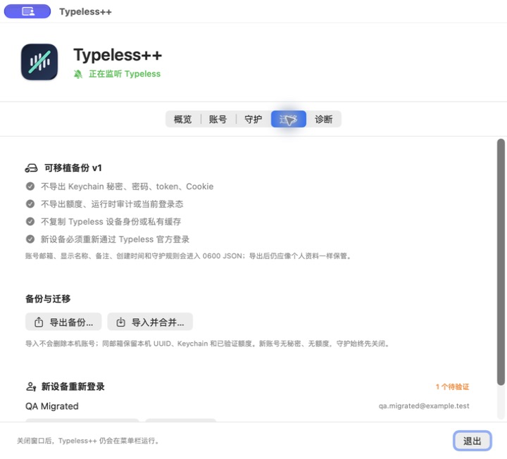
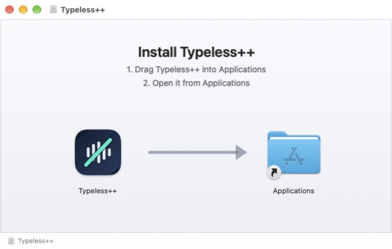

# Typeless++

[](https://github.com/timmyagentic/typeless-plusplus/actions/workflows/ci.yml)

一个轻量、原生的 macOS 菜单栏工具：自动关闭 Typeless 的瞬时付费升级提示，并在本机
管理用户已有账号、只读显示当前账号与剩余额度。当前源码兼容旧版
`Upgrade for enhanced accuracy`，以及 Typeless 2.4.0 的
`Get unlimited words` / `获取无限字数` 文案。

`Typeless++` 已从单一的 Quiet 工具扩展为 Typeless 的本地增强层：账号与额度基础、
基于官方登录的安全切换、可选低额度守护，以及无秘密备份迁移都已进入当前源码。
设计与边界见 [产品路线图](docs/ROADMAP.md)。

Typeless++ 是非官方项目，与 Typeless 或 Simply LLC 没有隶属、授权或合作关系。

## 界面预览









> 最近公开版本 `v0.1.5` 仍使用旧品牌 Typeless Quiet，提供 macOS 13+ Apple Silicon
> arm64 下载。App 已使用 Developer ID 签名、
> Apple notarization 并 staple 公证票据，可通过 Gatekeeper 验证。服务器下发提示的真实
> 客户端 AX 结构仍待现场验证。

## 为什么不是 Hammerspoon

Typeless++ 直接使用 macOS Accessibility API，不依赖 Hammerspoon、Node、npm、
Electron 或第三方 Swift 包。它不会修改 Typeless 应用包，也不会拦截网络请求。

应用需要常驻，但只在 Typeless 运行时连接其 Accessibility 树。它优先响应窗口和布局的
Accessibility 通知，并只保留低频 watchdog；通知完全不可用时才降级轮询。Typeless 未
运行时，它只等待系统的应用启动通知。

## 安全边界

规则必须同时满足以下条件才会执行 `AXPress`：

1. 目标进程 Bundle ID 精确等于 `now.typeless.desktop`。
2. 容器必须是 Tooltip、Dialog、Popover、Sheet 或 Electron 映射出的 Application Dialog。
3. 容器或后代文本必须精确等于已知的新旧英文、简体中文或繁体中文目标文案；不做模糊匹配。
4. 关闭候选是目标卡片的后代 `AXButton`。
5. 候选必须带 `AXCloseButton` / `AXCancelButton`、Close/Dismiss/关闭语义或明确的
   close/dismiss identifier；旧版无名称 14–20 pt 按钮仅作为兼容分支。所有候选都必须
   位于卡片内部右上角。
6. 候选支持 `AXPress`，并且全卡片中恰好只有一个候选。
7. 执行动作前重新抓取一次 AX 树，结果必须与首次判断完全一致。

任一条件不满足、遍历超过上限、出现多个目标卡片或多个按钮时，应用都会停止本次操作。
它不会全局搜索 Close 按钮，也不会使用屏幕坐标点击。Typeless 2.4.0 左下角常驻的
“获取无限字数 / 升级”订阅卡片不是瞬时容器、也没有关闭动作，因此不会被匹配或点击。

## 账号与额度

- “概览”只读显示 Typeless 当前账号、订阅方案和剩余额度；无法可靠读取时明确显示“未知”。
- “账号”页管理用户已有账号，可添加、编辑、暂停和删除，并按标准化邮箱拒绝重复项。
- 普通账号元数据写入 `~/Library/Application Support/Typeless++/accounts.json`，使用
  schema v1、原子写入和仅当前用户可读权限。
- 密码等可选秘密按账号 UUID 独立写入 macOS Keychain；账号 JSON 不含密码、token、
  Cookie、验证码或 Typeless 设备身份。
- 当前身份只从 Typeless `app-storage.json` 的白名单字段读取；额度优先从 Typeless
  当前可见的 Accessibility 文本读取。应用不会修改 Typeless 文件或界面状态。
- “诊断”页说明账号目录、Keychain、Typeless 安装/运行和额度来源，不输出秘密。

## 安全切换

账号页和菜单栏可以“一键开始”切换：Typeless++ 只打开
[Typeless 官方登录页](https://www.typeless.com/login)，由用户在官方页面选择或登录目标账号，
再由官网自行 handoff 到 Typeless 桌面端。Typeless++ 不读取、构造或记录官网生成的
`typeless://` 认证链接，也不会自动填写密码。

每次切换都按下面的事务执行：

1. Preflight 要求当前账号已管理、额度新鲜、目标可用，并从 Typeless 2.4.0 可见控件明确
   证明当前空闲。正在录音、仍在处理转录或活动状态未知时直接停止。
2. 打开固定的 HTTPS 官方登录页；没有浏览器脚本、token 注入或 Typeless 私有文件修改。
3. 最多 90 秒有限验证。只有本次请求后重新读取到目标邮箱和新鲜额度，才显示成功。
4. 超时但原邮箱仍在时明确显示“原账号已保留”；若出现目标但额度不可验证或出现其他账号，
   自动打开同一官方登录页恢复原账号，并继续验证原邮箱和新鲜额度。

切换事件写入 `~/Library/Application Support/Typeless++/switch-audit.json`：只含 transaction/
账号 UUID、阶段、时间、结果和固定错误码，不含邮箱、URL、密码、token、Cookie 或设备身份。
最近记录可以在“诊断”页查看。保存账号秘密本身不会让 Typeless 自动登录。

## 可选低额度守护

“守护”页提供一个默认关闭的低额度检查器。用户必须显式配置并启用：

- 剩余字数阈值。
- 至少两个账号组成的有序账号池；当前账号之后的首个合格账号是唯一目标。
- 基础冷却时间；失败后按 2 倍指数退避，上限 24 小时，成功后清零。

只有启用时才创建 60 秒低频 Timer，也可以手动“立即检查”。每轮最多触发一次 P2 安全切换，
并继续使用相同的官方登录、目标验证和原账号恢复；它没有第二条静默切换路径。触发后可能
打开 Typeless 官方登录页，需要用户在官网选择账号。

以下任一情况都会 no-op：当前额度不低、Typeless 未运行、正在录音/处理、活动未知、已有切换、
冷却中、池 ID 重复/缺失、当前账号不在池，或当前/候选账号的额度快照超过 5 分钟。严格的
候选新鲜度意味着后台不会凭很久以前的余额猜测可用账号。

配置与冷却状态写入 `~/Library/Application Support/Typeless++/quota-guard.json`，使用 schema
v1、0700/0600 权限，不含邮箱、密码、token、Cookie 或设备身份。

## 备份与迁移

“迁移”页可以导出 `typeless-plusplus-backup` schema v1 JSON，并在另一台 Mac 上预览后合并：

- 导出账号 UUID、标准化邮箱、显示名称、备注、创建时间，以及守护阈值/冷却/有序账号池。
- 明确不导出 Keychain 秘密/引用、密码、token、Cookie、验证码、额度快照、当前登录态、
  守护 runtime、切换 audit 或 Typeless 设备身份/私有缓存。
- 文件使用 ISO8601 日期、最大 5 MiB/1000 个账号，写入后权限为 0600；security manifest
  明确声明不含秘密/设备身份并要求官方重新认证。
- 导入只 merge，不删除本机账号。同邮箱保留本机 UUID、Keychain、额度和已验证状态；
  新邮箱以 unknown、无额度、无秘密加入，UUID 冲突会重映射。
- 守护规则会迁移，但导入后强制关闭、runtime 清零。账号目录和守护配置作为两步事务提交；
  第二步失败会恢复两者，回滚失败会明确报错。
- 新设备使用迁移页的“打开 Typeless 官方登录”，逐个登录后刷新。只有匹配邮箱和新鲜额度
  都读到后，导入账号才从 unknown 变为 available。

备份包含邮箱和用户备注，虽然不含应用管理的秘密，仍应像个人资料一样妥善保管。

## 系统要求

- macOS 13 或更高版本
- 构建时需要 Xcode/Swift 工具链
- 运行时需要用户手动授予“辅助功能”权限

## 最近公开版本（旧品牌 v0.1.5）

- [Typeless Quiet v0.1.5 Release](https://github.com/timmyagentic/typeless-plusplus/releases/tag/v0.1.5)
- 平台：macOS 13+，Apple Silicon arm64
- 推荐资产：`Typeless-Quiet-0.1.5-macos-arm64.dmg`
- 备用资产：`Typeless-Quiet-0.1.5-macos-arm64.zip`
- 校验：两种格式均提供 `.sha256` 文件

该历史 DMG 内的 App 名称仍是 Typeless Quiet。打开后先将它拖入 Applications，再从
Applications 打开。App
会在权限缺失时显示可见的原生授权引导，并提供直达系统设置的按钮。App 与 DMG 都已
完成 Apple notarization 与 stapling。公证和 Developer ID 签名不代表真实弹窗 E2E 已
验证；该项仍需在服务器提示实际出现时完成。

当前源码构建产物名为 `Typeless++.app`。正常打开会显示主窗口；关闭窗口后仍会在菜单栏
运行。登录项自动启动时不会主动弹出主窗口，再次从 Applications 打开即可显示或置前。

## 构建与验证

```bash
git clone https://github.com/timmyagentic/typeless-plusplus.git
cd typeless-plusplus
make verify
```

验证通过后，应用位于：

```text
dist/Typeless++.app
```

重新生成 App 图标和 DMG 背景、制作本地测试 DMG：

```bash
make assets
make dmg
```

DMG 布局使用系统 Finder 自动化写入 `.DS_Store`；首次运行构建脚本时，macOS 可能要求
允许当前终端控制 Finder。该权限只用于设置安装卷的背景、图标位置和窗口状态。

默认构建使用本机 ad-hoc 签名。如果需要在多次本地升级后尽量保持稳定的应用身份，
可以传入 Keychain 中已有的固定代码签名证书：

```bash
CODE_SIGN_IDENTITY='Developer ID Application: …' make verify
```

本地 Developer ID 签名不等于公证；对外分发前仍需单独完成 notarization。

## 本机安装

从源码构建后，默认安装到 `~/Applications`，不会覆盖现有副本：

```bash
./scripts/install.sh
```

升级本地副本时，旧版本会先移动为带时间戳的备份：

```bash
./scripts/install.sh --replace
```

备份默认位于 `~/Library/Application Support/Typeless++/Backups/`，并使用
`.app-backup` 后缀，避免 macOS 把旧副本识别成可启动 App。恢复时退出当前 App，将目标
备份改回 `.app` 后再移入 Applications。

首次启动后：

1. 正常打开时会显示主窗口；权限缺失时优先显示可见的原生设置引导。
2. 每个 App build 最多自动尝试一次 macOS 官方权限提示；若系统不再重复显示，使用引导
   中的按钮直接打开系统设置。
3. 在“设备控制和数据访问”（部分 macOS 显示为“辅助功能”）中批准 Typeless++。
4. 应用会默认注册“登录时启动”；若系统要求额外批准，菜单会显示对应状态。
5. 你随时可以从菜单关闭登录启动，应用不会在下次启动时重新强制开启。

系统权限最终仍必须由用户批准，应用不会静默绕过 macOS 权限。若系统提示被拒绝，原生
设置引导会在权限仍缺失的下次启动再次出现，不会再被历史的一次性标记静默跳过；菜单中
也保留手动入口。

## 卸载

1. 在菜单中关闭“登录时启动”。
2. 退出 Typeless++。
3. 将 `~/Applications/Typeless++.app` 移到废纸篓；从旧版升级的用户也可检查旧路径
   `~/Applications/Typeless Quiet.app`。
4. 如需清理授权，在“系统设置 → 隐私与安全性 → 设备控制和数据访问”（部分 macOS
   显示为“辅助功能”）移除它。

## 运行状态与日志

主窗口和菜单栏都会显示等待 Typeless、正在监听、缺少权限、暂停或 fail-closed 原因。
系统日志只记录规则结果，不记录输入内容或其他界面文本：

```bash
log stream --predicate 'subsystem == "io.github.timmyagentic.TypelessQuiet"'
```

为保持既有辅助功能授权、偏好与登录项，Typeless++ 暂时沿用旧 Bundle ID
`io.github.timmyagentic.TypelessQuiet`；这是有意的升级兼容约束。

## 当前验证限制

匹配器、Release 构建、应用包结构和签名可以自动验证；但目标提示由服务器下发，
只有它实际出现时才能确认 Typeless 当前版本暴露的 AX Role、层级和几何仍与规则一致。
在完成这项现场验证前，真实自动关闭行为应视为 `UNVERIFIED`。

当前账号只读识别依赖 Typeless 2.4.0 的本地白名单字段；额度读取依赖当前界面实际暴露
`已用 / 总量` 文本。Typeless 未运行或界面没有该文本时额度会显示“未知”，不会沿用为新鲜值。

安全切换的状态机、官方 URL 边界和 fixture 成功/失败/恢复路径可以自动验证；真实切换仍需要
用户在 Typeless 官方页面完成登录。没有指定可用目标账号时，不会在 QA 中擅自改变真实登录态。

## 参与贡献

欢迎提交 Issue 或 Pull Request。涉及匹配范围的修改必须附带负例测试；规则应继续保持
fail closed，不能改成全局 Close 按钮搜索、模糊标题或屏幕坐标点击。

## License

[MIT](LICENSE)
